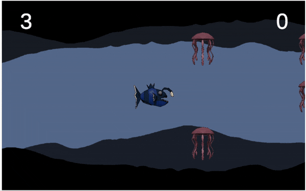
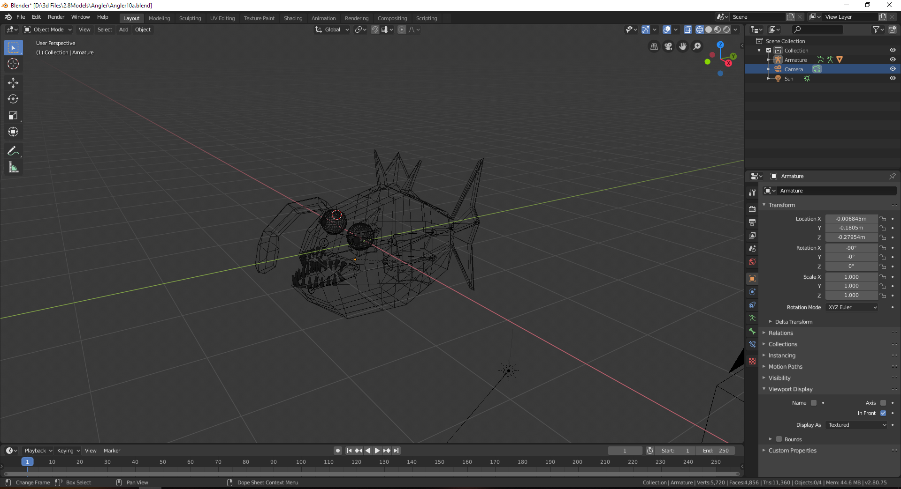
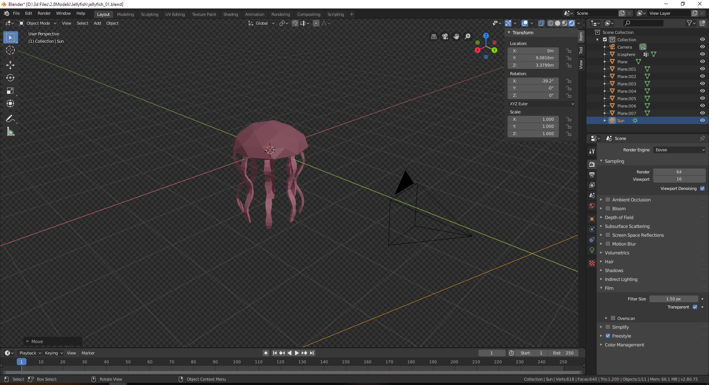

# Endless Runner A Foray into Game Development!
- An Endless Runner Game built in Unity and C#

# Play Now!
  - [Playable Link](https://pnadiadhara.github.io/EndlessRunnerUnityHost/index.html) 

# Custom assets modeled and rendered in Blender

 

 

### Tech
* [Unity + C#] (https://unity.com/) - The world’s most popular development platform for creating 2D and 3D multiplatform games and interactive experiences.
* [Blender] (https://www.blender.org/)